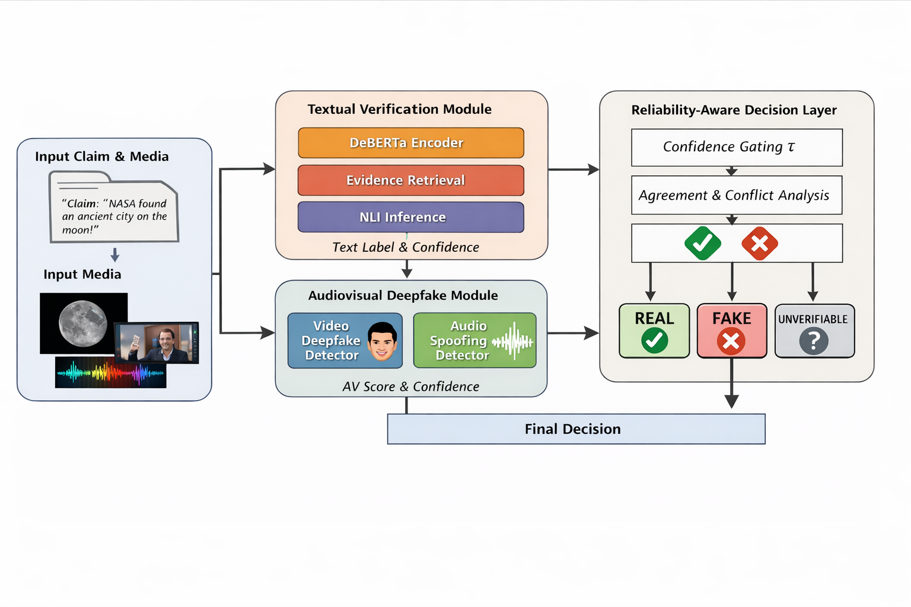

# C³-MMFD: Reliability-Aware Multimodal Fake News and Deepfake Detection

## Overview

C³-MMFD (Credibility-aware Cross-modal Multimodal Fake News Detection) is a multimodal artificial intelligence framework designed to detect misinformation across multiple modalities including text, images, and videos.

With the rapid growth of misinformation on social media, fake news and deepfake media have become a major challenge. Traditional detection systems often analyze a single modality independently and assume equal reliability across all modalities.

C³-MMFD introduces a reliability-aware multimodal fusion framework that evaluates and combines information from multiple modalities to improve detection accuracy and robustness.

This repository contains the implementation, experiments, and evaluation of the proposed framework.

---

## Key Features

• Multimodal fake news detection  
• Deepfake media detection  
• Reliability-aware modality fusion  
• Cross-modal feature extraction  
• Deep learning based classification  
• Experimental evaluation on benchmark datasets  

---

## System Architecture

The proposed framework integrates information from multiple modalities and evaluates their reliability before performing final classification.

Architecture Diagram:



---

## Datasets Used

The framework is evaluated on multiple benchmark datasets commonly used in misinformation detection research.

| Dataset | Description |
|------|------|
| **LIAR** | Short political statements labeled for truthfulness |
| **FEVER** | Fact extraction and verification dataset |
| **SciFact** | Scientific claim verification dataset |

Dataset links are provided in the `datasets` directory.

---

## Project Structure
```C3-MMFD: Multimodal-Fake-News-Detection-and-Deepfake-Videos

│
├── README.md
├── requirements.txt
├── LICENSE
│
├── notebooks
│ ├── 01_data_preprocessing.ipynb
│ ├── 02_text_model_training.ipynb
│ ├── 03_image_model_training.ipynb
│ ├── 04_multimodal_fusion.ipynb
│ ├── 05_evaluation.ipynb
│
├── src
│ ├── data_loader.py
│ ├── preprocessing.py
│ ├── model.py
│ ├── fusion.py
│ ├── evaluation.py
│
├── datasets
│ └── dataset_links.md
│
├── results
│ ├── accuracy_results.png
│ ├── confusion_matrix.png
│ ├── ablation_results.png
│
└── docs
└── Architecture.png
```

---

## Technologies Used

- Python
- PyTorch / TensorFlow
- HuggingFace Transformers
- OpenCV
- Scikit-learn
- NumPy
- Pandas
- Google Colab

---

## Final Output


## Installation

**Clone the repository:** 

git clone https://github.com/yourusername/C3-MMFD-Multimodal-Fake-News-Detection.git

**Navigate to the project folder:** 

cd C3-MMFD-Multimodal-Fake-News-Detection

**Install dependencies:** 

pip install -r requirements.txt


---

## How to Run

1. Run **data preprocessing notebook**
2. Train the **text model**
3. Train the **image model**
4. Perform **multimodal fusion**
5. Evaluate the model performance

All experiment notebooks are located in the `notebooks` directory.

---

## Experimental Results

The framework was evaluated using multiple benchmark datasets and achieved improved performance through reliability-aware multimodal fusion.

Example outputs include:

- Accuracy comparison
- Confusion matrix
- Ablation study results

Results are available in the `results` directory.

---

## Research Paper

This repository accompanies the research work:

**"C³-MMFD: Reliability-Aware Multimodal Fake News and Deepfake Detection"**

Submitted to: **RACCAI 2026 Conference**

---

## Author

**Aditya Rawat**

---

## License

This project is licensed under the **MIT License**.

---

## Acknowledgements

This project was developed as part of research in multimodal misinformation detection and deepfake analysis.

